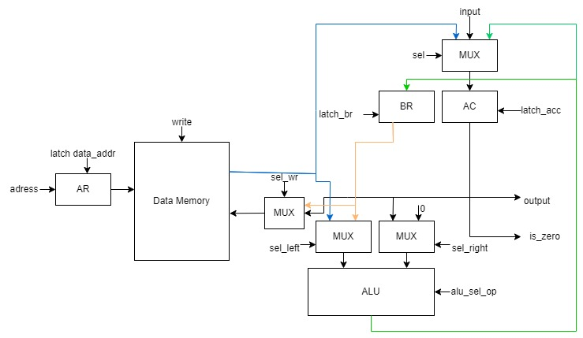

# CSA-LAB 3

Выполнила
ФИО: Толстых Мария Алексеевна
Группа: P3230

Вариант
Без усложнения  ```asm | cisc | harv | hw | tick | struct | stream | port | pstr | prob1```

* ЯП, Синтаксис: asm; Необходима поддержка label-ов

* Архитектура: cisc; Система команд должна содержать сложные инструкции переменной длины и разрешающие адресацию как регистров, так и памяти

* Организация памяти: harv - Гарвардская архитектура

* Control Unit: hw - hardwired; Реализуется как часть модели

* Точность модели: tick; Процессор необходимо моделировать с точности до такта

* Представление машинного кода: struct; В виде высокоуровневой структуры данных; Считается, что одна инструкция укладывается в одно машинное слово, за исключением CISC архитектур; ПРИМЕЧАНИЕ. Транслятор переводит исходный код в класс Program, который затем сериализуется в бинарный вид. Компьютер использует десериализованный класс Program.

* Ввод-вывод: stream; Осуществляется как поток токенов.; Ввод - считали значение, упортребили токен.

* port -- port-mapped (специальные инструкции для ввода-вывода); адресация портов ввода-вывода должна присутствовать.

* Поддержка строк: pstr; Length-prefixed (Pascal string); Статические строки должны храниться в памяти данных.; Один символ может храниться в одном машинном слове (несмотря на явную неэффективность).

## Язык программирования

``` text

program ::= line "\n" program

line ::= label
       | command
       | section
       | variable

label ::= label_name ":" command

command ::= "\t" operation_2_args " " operand " " operand |
            "\t" operation_1_arg " " operand |
            "\t" operation_0_args |

operation_2_args ::= "mov" | "cmp" | "cmp*" | "rdiv" | "add" | "sub" | "mul" | "div"

operation_1_arg ::= "in" | "out" | "out#" | "out_char" | "jmp" | "je" | "save"

operation_0_args ::= "hlt"

operand ::= variable_name | label_name | number

section ::= "." section_name

section_name ::= "text" | "data"

variable ::= variable_type " " variable_name ": " variable_value

variable_type ::= "num" | "str"

label_name ::= [a-z_]+
          
variable_name ::= [a-z_]+[0-9]+

variable_value ::= number | string

string ::= "[a-zA-z0-9!@#$%^&*().,]+"

number ::= [-2^32; 2^32 - 1]

```

Последовательное выполнение кода. 

## Организация памяти

Модель памяти процессора:

1. Память команд. Машинное слово -- не определено. Реализуется списком словарей, описывающих инструкции (одно слово -- одна ячейка).
2. Память данных. Машинное слово -- 32 бита, знаковое. Линейное адресное пространство. Реализуется списком чисел.

Строки, объявленные пользователем распределяются по памяти один символ на ячейку.

``` text

     Instruction memory
+-----------------------------+
| 00  : cmp last divisor      |
| 01  : je end                |
|    ...                      | 
| n   : hlt                   |
|    ...                      |
+-----------------------------+

Data memory
+-----------------------------+
| 00  : number                |
| 01  : number                |
| 03  : number                |
|    ...                      |
| 98  : number                |
| 99  : number                |
| 100 : number                |
|    ...                      |
+-----------------------------+

```

## Система команд

Особенности процессора:


* Машинное слово -- 32 бит, знаковое.
* Память данных:
  *  адресуется через регистр ```data_address```;
  * может быть записана:
    *  из аккумулятора ```acc```;
    * с буферного регистра ```br```;
  * может быть прочитана в аккумулятор `acc`:
* Регистр аккумулятора ```acc```:
  *  может быть подан на вывод;
  * используется как флаг (сравнение с 0);
* Ввод-вывод -- порты ввода/вывода, токенизирован, символьный.
* ```program_counter``` -- счётчик команд:
  *  инкрементируется после каждой инструкции или перезаписывается инструкцией перехода.


## Набор инструкции

| Syntax                                         | Mnemonic    | Кол-во тактов | Comment                                                                                                            |
|:-----------------------------------------------|:------------|---------------|:-------------------------------------------------------------------------------------------------------------------|
| ```mov```                                      | mov         | 3             | mov <arg1> <arg2> -- присваивает второму аргументу значение первого аргумента                                      |
| ```cmp```                                      | cmp         | 3             | cmp <arg1> <arg2> -- производится вычитание из второго аргумента первого с целью их сравнения                      |
| ```cmp*```                                     | cmp_rel_inc | 6             | cmp* <arg1> <arg2> -- аналог cmp, но с косвенной автоинкрементной адресацией                                       |
| ```rdiv```                                     | rdiv        | 3             | rdiv <arg1> <arg2> -- получить остаток от деления первого аргумента на второй                                      |
| ```add```                                      | add         | 4             | add <arg1> <arg2> -- прибавить первый аргумент ко второму и перезаписать результат в память на место первого       |
| ```sub```                                      | sub         | 4             | sub <arg1> <arg2> -- вычесть второй аргумент из первого и перезаписать результат в память на место первого         |
| ```mul```                                      | mul         | 4             | mul <arg1> <arg2> -- умножить первый аргумент на второй и перезаписать результат в память на место первого         |
| ```div```                                      | div         | 4             | div <arg1> <arg2> -- разделить нацело первый аргумент на второй и перезаписать результат в память на место первого |
| ```in```                                       | in          | 2             | in <arg> -- прочитать символ из потока ввода                                                                       |
| ```out```                                      | out         | 3             | out <arg> -- вывести число в поток вывода                                                                          |
| ```out#```                                     | out_rel     | 4             | out# <arg> -- аналог out, но с косвенной адресацией (не автоинкрементной)                                          |
| ```out_char```                                 | out_char    | 3             | out_char <arg> -- вывести символ в поток вывода                                                                    |
| ```jmp```                                      | jmp         | 1             | jmp <label> -- безусловный переход по адресу метки                                                                 |
| ```je```                                       | je          | 1             | je <label> -- переход по адресу метки, в случае, если выставлен zero-флаг                                          |
| ```save```                                     | save        | 2             | save <arg> -- сохраняет значение из аккумулятора в переменную                                                      |
| ```hlt```                                      | hlt         | 1             | hlt -- завершить выполнение программы                                                                              |

## Кодирование инструкций


- Сериализация машинного кода в JSON.
- Один элемент списка, одна инструкция.
- Индекс списка -- адрес инструкции(для команд перехода).


Пример:

```json
[
  {
    "opcode": "add",
    "addr": 0,
    "args": [
      1,
      4
    ]
  }
]
```

где:
- ```opcode``` -- строка с кодом операции;

- ```addr``` -- адрес команды. Начиная с первой в секции ```.text``` команды выполняются по очереди. Нумерация с нуля;

- ```args``` -- адреса аргументов от первого до последнего. Если их нет - список пустой.

Типы данные в модуле [isa](./isa.py) с перечислением кодов операций -- ```Opcode```.

## Микропрограммное управление

- Каждая инструкция разбита на последовательность микрокоманд.
- Микрокоманда -- набор сигналов, подаваемых на линии.
- Память микрокоманд ```mc_memory``` находится в ```ControlUnit```.
- Каждая микрокоманда выполняется за такт, соответственно моделирование происходит на уровне тиков.
- Исполнение каждой инструкции заканчивается микрокомандой перехода на другую инструкцию, либо завершением программы.

| Microcomand                                                  | Comment                                      |
|:-------------------------------------------------------------|:---------------------------------------------|
| `read_first_arg`                                             | Чтение первого аргумента команды             |
| `write_from_input`                                           | Запись в память из входного буфера           |
| `read_from_acc_addr`                                         | Чтение из памяти по адресу в аккумуляторе    |
| `write_acc_by_second_arg`                                    | Запись в память по адресу второго аргумента  |
| `write_acc_by_first_arg`                                     | Запись в память по адресу первого аргумента  |
| `write_br`                                                   | Запись в память буферного регистра           |
| `alu_cmp`/`alu_rdiv`/`alu_add`/`alu_sub`/`alu_mul`/`alu_div` | Выбор операции АЛУ                           |
| `inc_addr`                                                   | Постинкремент адреса для косвенной адресации |
| `out_num`                                                    | Сигнал вывода числа                          |
| `out_char`                                                   | Сигнал вывода символа                        |
| `next_instr`                                                 | Следующая по порядку инструкция              |
| `jump_instr`/`jmp_zero`                                      | Переход по памяти команд                     |
| `stop_program`                                               | Останов                                      |

## Транслятор

Интерфейс командной строки: `translator.py <input_file> <target_file>`

Реализовано в модуле: [translator](./translator.py)

Этапы трансляции (функция `translate`):
1. Трансформирование текста в последовательность значимых машинных слов.
  - Переменные:
    - На этапе трансляции создается файл с данными `data_file.txt`, в который записываются значения всех переменных. Команды оперируют адресами на них
    - Задаётся либо числовым значением, либо указателем на начало строки (используя string)
2. Проверка корректности программы (наличие нужных секций, корректность меток, переменных и т.д.).
3. Генерация машинного кода.

Правила генерации машинного кода:

- одно слово языка -- одна инструкция;
- для команд, однозначно соответствующих инструкциям -- прямое отображение;

## Модель процессора

Реализация: [machine](./machine.py).

### DataPath



Реализация: класс `DataPath`.

Сигналы (обрабатываются за один такт, реализованы в виде методов класса):

- `wr` -- записать в data_memory
- `latch_data_address` -- защёлкнуть значение в `data_address`
- `latch_acc` -- защёлкнуть значение в `acc`
- `latch_br` -- защёлкнуть значение в `br`
- `sel` -- сигнал мультиплексору для выбора значения, подаваемого в аккумулятор
- `sel_wr` -- сигнал мультиплексору для выбора значения, записываемого в память
- `sel_left` -- сигнал мультиплексору для выбора значения, подаваемого на левый вход АЛУ
- `sel_right` -- сигнал мультиплексору для выбора значения, подаваемого на правый вход АЛУ
- `alu_sel_op` -- сигнал выбора операции в АЛУ

Флаги:

- `is_zero` -- лежит ли в аккумуляторе 0.

## ControlUnit


Реализовация: класс `ControlUnit`.

- Микрокод - непосредственно выводимые на сигнальные линии значения. Сигналы реализованы в виде функций на python
- Моделирование на уровне тактов.
- Трансляция инструкции в последовательность микрокоманд: `decode_and_execute_instruction`. На схеме - Instruction Decoder

Особенности работы модели:

- Для журнала состояний процессора используется стандартный модуль logging.
- Количество инструкций для моделирования ограничено hardcoded константой.
- Поддержка сложных многотактовых иснтрукий, осуществляющих и обращения к памяти и арифметику в рамках одной команды, как в CISC-архитектурах
- Небольшое число рабочих регистров (аккумулятор и буфферный регистр)
- Остановка моделирования осуществляется при помощи исключений:
  - `EOFError` -- если нет данных для чтения из порта ввода-вывода;
  - `StopIteration` -- если выполнена инструкция `halt`.
- Управление симуляцией реализовано в функции `simulate`.

## Апробация

Тесты для `machine`:

1. [hello world](examples/hello.asm).
2. [cat](examples/cat.asm) -- программа `cat`, повторяем ввод на выводе.
3. [prob1](examples/prob1.asm) -- программа, решающая первую задачу Эйлера.
4. [sum](examples/sum.asm) -- программа, считающая сумму натуральных чисел от 1 до 100.

Тесты для `translator`:
1. [hello world](examples/hello.asm).
2. [cat](examples/cat.asm) -- программа `cat`, повторяем ввод на выводе.
3. [prob1](examples/prob1.asm) -- программа, решающая первую задачу Эйлера.
4. [sum](examples/sum.asm) -- программа, считающая сумму натуральных чисел от 1 до 100.

Реализация интеграционных тестов: [machine_integration_test](./machine_integration_test.py) и [translator_integration_test](./translator_integration_test.py)

Реализация golden-тестов: [golden_test](./golden_test.py)

Пример использования и журнал работы процессора на примере `cat`:

``` console
mariia@Mariia:/mnt/d/csa-lab3$ cat examples/cat.asm
.data:
num tmp: 0

.text:

loop: in tmp
out_char tmp
jmp loop
end: hlt

mariia@Mariia:/mnt/d/csa-lab3$ python3 translator.py examples/cat.asm target.out
source LoC: 14 code instr: 4

mariia@Mariia:/mnt/d/csa-lab3$ cat target.out
[
    {
        "opcode": "in",
        "addr": 0,
        "args": [
            0
        ]
    },
    {
        "opcode": "out_char",
        "addr": 1,
        "args": [
            0
        ]
    },
    {
        "opcode": "jmp",
        "addr": 2,
        "args": [
            0
        ]
    },
    {
        "opcode": "hlt",
        "addr": 3,
        "args": []
    }
]

mariia@Mariia:/mnt/d/csa-lab3$python3 machine.py examples/cat_code.out examples/input.txt
DEBUG:root:{TICK: 0, ADDR: 0, PC: 0, OUT: 0, ACC: 0} 
DEBUG:root:{TICK: 1, ADDR: 0, PC: 0, OUT: 71, ACC: 71}
DEBUG:root:{TICK: 2, ADDR: 0, PC: 1, OUT: 71, ACC: 71}
DEBUG:root:{TICK: 3, ADDR: 0, PC: 1, OUT: 71, ACC: 71}
DEBUG:root:output: '' << 'G'
DEBUG:root:{TICK: 4, ADDR: 0, PC: 1, OUT: 71, ACC: 71}
DEBUG:root:{TICK: 5, ADDR: 0, PC: 2, OUT: 71, ACC: 71}
DEBUG:root:{TICK: 6, ADDR: 0, PC: 0, OUT: 71, ACC: 71}
DEBUG:root:{TICK: 7, ADDR: 0, PC: 0, OUT: 111, ACC: 111}
DEBUG:root:{TICK: 8, ADDR: 0, PC: 1, OUT: 111, ACC: 111}
DEBUG:root:{TICK: 9, ADDR: 0, PC: 1, OUT: 111, ACC: 111}
DEBUG:root:output: 'G' << 'o'
DEBUG:root:{TICK: 10, ADDR: 0, PC: 1, OUT: 111, ACC: 111}
DEBUG:root:{TICK: 11, ADDR: 0, PC: 2, OUT: 111, ACC: 111}
DEBUG:root:{TICK: 12, ADDR: 0, PC: 0, OUT: 111, ACC: 111}
DEBUG:root:{TICK: 13, ADDR: 0, PC: 0, OUT: 111, ACC: 111}
DEBUG:root:{TICK: 14, ADDR: 0, PC: 1, OUT: 111, ACC: 111}
DEBUG:root:{TICK: 15, ADDR: 0, PC: 1, OUT: 111, ACC: 111}
DEBUG:root:output: 'Go' << 'o'
DEBUG:root:{TICK: 16, ADDR: 0, PC: 1, OUT: 111, ACC: 111}
DEBUG:root:{TICK: 17, ADDR: 0, PC: 2, OUT: 111, ACC: 111}
DEBUG:root:{TICK: 18, ADDR: 0, PC: 0, OUT: 111, ACC: 111}
DEBUG:root:{TICK: 19, ADDR: 0, PC: 0, OUT: 100, ACC: 100}
DEBUG:root:{TICK: 20, ADDR: 0, PC: 1, OUT: 100, ACC: 100}
DEBUG:root:{TICK: 21, ADDR: 0, PC: 1, OUT: 100, ACC: 100}
DEBUG:root:output: 'Goo' << 'd'
DEBUG:root:{TICK: 22, ADDR: 0, PC: 1, OUT: 100, ACC: 100}
DEBUG:root:{TICK: 23, ADDR: 0, PC: 2, OUT: 100, ACC: 100}
DEBUG:root:{TICK: 24, ADDR: 0, PC: 0, OUT: 100, ACC: 100}
DEBUG:root:{TICK: 25, ADDR: 0, PC: 0, OUT: 32, ACC: 32}
DEBUG:root:{TICK: 26, ADDR: 0, PC: 1, OUT: 32, ACC: 32}
DEBUG:root:{TICK: 27, ADDR: 0, PC: 1, OUT: 32, ACC: 32}
DEBUG:root:output: 'Good' << ' '
DEBUG:root:{TICK: 28, ADDR: 0, PC: 1, OUT: 32, ACC: 32}
DEBUG:root:{TICK: 29, ADDR: 0, PC: 2, OUT: 32, ACC: 32}
DEBUG:root:{TICK: 30, ADDR: 0, PC: 0, OUT: 32, ACC: 32}
DEBUG:root:{TICK: 31, ADDR: 0, PC: 0, OUT: 100, ACC: 100}
DEBUG:root:{TICK: 32, ADDR: 0, PC: 1, OUT: 100, ACC: 100}
DEBUG:root:{TICK: 33, ADDR: 0, PC: 1, OUT: 100, ACC: 100}
DEBUG:root:output: 'Good ' << 'd'
DEBUG:root:{TICK: 34, ADDR: 0, PC: 1, OUT: 100, ACC: 100}
DEBUG:root:{TICK: 35, ADDR: 0, PC: 2, OUT: 100, ACC: 100}
DEBUG:root:{TICK: 36, ADDR: 0, PC: 0, OUT: 100, ACC: 100}
DEBUG:root:{TICK: 37, ADDR: 0, PC: 0, OUT: 97, ACC: 97}
DEBUG:root:{TICK: 38, ADDR: 0, PC: 1, OUT: 97, ACC: 97}
DEBUG:root:{TICK: 39, ADDR: 0, PC: 1, OUT: 97, ACC: 97}
DEBUG:root:output: 'Good d' << 'a'
DEBUG:root:{TICK: 40, ADDR: 0, PC: 1, OUT: 97, ACC: 97}
DEBUG:root:{TICK: 41, ADDR: 0, PC: 2, OUT: 97, ACC: 97}
DEBUG:root:{TICK: 42, ADDR: 0, PC: 0, OUT: 97, ACC: 97}
DEBUG:root:{TICK: 43, ADDR: 0, PC: 0, OUT: 121, ACC: 121}
DEBUG:root:{TICK: 44, ADDR: 0, PC: 1, OUT: 121, ACC: 121}
DEBUG:root:{TICK: 45, ADDR: 0, PC: 1, OUT: 121, ACC: 121}
DEBUG:root:output: 'Good da' << 'y'
DEBUG:root:{TICK: 46, ADDR: 0, PC: 1, OUT: 121, ACC: 121}
DEBUG:root:{TICK: 47, ADDR: 0, PC: 2, OUT: 121, ACC: 121}
DEBUG:root:{TICK: 48, ADDR: 0, PC: 0, OUT: 121, ACC: 121}
DEBUG:root:{TICK: 49, ADDR: 0, PC: 0, OUT: 44, ACC: 44}
DEBUG:root:{TICK: 50, ADDR: 0, PC: 1, OUT: 44, ACC: 44}
DEBUG:root:{TICK: 51, ADDR: 0, PC: 1, OUT: 44, ACC: 44}
DEBUG:root:output: 'Good day' << ','
DEBUG:root:{TICK: 52, ADDR: 0, PC: 1, OUT: 44, ACC: 44}
DEBUG:root:{TICK: 53, ADDR: 0, PC: 2, OUT: 44, ACC: 44}
DEBUG:root:{TICK: 54, ADDR: 0, PC: 0, OUT: 44, ACC: 44}
DEBUG:root:{TICK: 55, ADDR: 0, PC: 0, OUT: 32, ACC: 32}
DEBUG:root:{TICK: 56, ADDR: 0, PC: 1, OUT: 32, ACC: 32}
DEBUG:root:{TICK: 57, ADDR: 0, PC: 1, OUT: 32, ACC: 32}
DEBUG:root:output: 'Good day,' << ' '
DEBUG:root:{TICK: 58, ADDR: 0, PC: 1, OUT: 32, ACC: 32}
DEBUG:root:{TICK: 59, ADDR: 0, PC: 2, OUT: 32, ACC: 32}
DEBUG:root:{TICK: 60, ADDR: 0, PC: 0, OUT: 32, ACC: 32}
DEBUG:root:{TICK: 61, ADDR: 0, PC: 0, OUT: 101, ACC: 101}
DEBUG:root:{TICK: 62, ADDR: 0, PC: 1, OUT: 101, ACC: 101}
DEBUG:root:{TICK: 63, ADDR: 0, PC: 1, OUT: 101, ACC: 101}
DEBUG:root:output: 'Good day, ' << 'e'
DEBUG:root:{TICK: 64, ADDR: 0, PC: 1, OUT: 101, ACC: 101}
DEBUG:root:{TICK: 65, ADDR: 0, PC: 2, OUT: 101, ACC: 101}
DEBUG:root:{TICK: 66, ADDR: 0, PC: 0, OUT: 101, ACC: 101}
DEBUG:root:{TICK: 67, ADDR: 0, PC: 0, OUT: 118, ACC: 118}
DEBUG:root:{TICK: 68, ADDR: 0, PC: 1, OUT: 118, ACC: 118}
DEBUG:root:{TICK: 69, ADDR: 0, PC: 1, OUT: 118, ACC: 118}
DEBUG:root:output: 'Good day, e' << 'v'
DEBUG:root:{TICK: 70, ADDR: 0, PC: 1, OUT: 118, ACC: 118}
DEBUG:root:{TICK: 71, ADDR: 0, PC: 2, OUT: 118, ACC: 118}
DEBUG:root:{TICK: 72, ADDR: 0, PC: 0, OUT: 118, ACC: 118}
DEBUG:root:{TICK: 73, ADDR: 0, PC: 0, OUT: 101, ACC: 101}
DEBUG:root:{TICK: 74, ADDR: 0, PC: 1, OUT: 101, ACC: 101}
DEBUG:root:{TICK: 75, ADDR: 0, PC: 1, OUT: 101, ACC: 101}
DEBUG:root:output: 'Good day, ev' << 'e'
DEBUG:root:{TICK: 76, ADDR: 0, PC: 1, OUT: 101, ACC: 101}
DEBUG:root:{TICK: 77, ADDR: 0, PC: 2, OUT: 101, ACC: 101}
DEBUG:root:{TICK: 78, ADDR: 0, PC: 0, OUT: 101, ACC: 101}
DEBUG:root:{TICK: 79, ADDR: 0, PC: 0, OUT: 114, ACC: 114}
DEBUG:root:{TICK: 80, ADDR: 0, PC: 1, OUT: 114, ACC: 114}
DEBUG:root:{TICK: 81, ADDR: 0, PC: 1, OUT: 114, ACC: 114}
DEBUG:root:output: 'Good day, eve' << 'r'
DEBUG:root:{TICK: 82, ADDR: 0, PC: 1, OUT: 114, ACC: 114}
DEBUG:root:{TICK: 83, ADDR: 0, PC: 2, OUT: 114, ACC: 114}
DEBUG:root:{TICK: 84, ADDR: 0, PC: 0, OUT: 114, ACC: 114}
DEBUG:root:{TICK: 85, ADDR: 0, PC: 0, OUT: 121, ACC: 121}
DEBUG:root:{TICK: 86, ADDR: 0, PC: 1, OUT: 121, ACC: 121}
DEBUG:root:{TICK: 87, ADDR: 0, PC: 1, OUT: 121, ACC: 121}
DEBUG:root:output: 'Good day, ever' << 'y'
DEBUG:root:{TICK: 88, ADDR: 0, PC: 1, OUT: 121, ACC: 121}
DEBUG:root:{TICK: 89, ADDR: 0, PC: 2, OUT: 121, ACC: 121}
DEBUG:root:{TICK: 90, ADDR: 0, PC: 0, OUT: 121, ACC: 121}
DEBUG:root:{TICK: 91, ADDR: 0, PC: 0, OUT: 111, ACC: 111}
DEBUG:root:{TICK: 92, ADDR: 0, PC: 1, OUT: 111, ACC: 111}
DEBUG:root:{TICK: 93, ADDR: 0, PC: 1, OUT: 111, ACC: 111}
DEBUG:root:output: 'Good day, every' << 'o'
DEBUG:root:{TICK: 94, ADDR: 0, PC: 1, OUT: 111, ACC: 111}
DEBUG:root:{TICK: 95, ADDR: 0, PC: 2, OUT: 111, ACC: 111}
DEBUG:root:{TICK: 96, ADDR: 0, PC: 0, OUT: 111, ACC: 111}
DEBUG:root:{TICK: 97, ADDR: 0, PC: 0, OUT: 110, ACC: 110}
DEBUG:root:{TICK: 98, ADDR: 0, PC: 1, OUT: 110, ACC: 110}
DEBUG:root:{TICK: 99, ADDR: 0, PC: 1, OUT: 110, ACC: 110}
DEBUG:root:output: 'Good day, everyo' << 'n'
DEBUG:root:{TICK: 100, ADDR: 0, PC: 1, OUT: 110, ACC: 110}
DEBUG:root:{TICK: 101, ADDR: 0, PC: 2, OUT: 110, ACC: 110}
DEBUG:root:{TICK: 102, ADDR: 0, PC: 0, OUT: 110, ACC: 110}
DEBUG:root:{TICK: 103, ADDR: 0, PC: 0, OUT: 101, ACC: 101}
DEBUG:root:{TICK: 104, ADDR: 0, PC: 1, OUT: 101, ACC: 101}
DEBUG:root:{TICK: 105, ADDR: 0, PC: 1, OUT: 101, ACC: 101}
DEBUG:root:output: 'Good day, everyon' << 'e'
DEBUG:root:{TICK: 106, ADDR: 0, PC: 1, OUT: 101, ACC: 101}
DEBUG:root:{TICK: 107, ADDR: 0, PC: 2, OUT: 101, ACC: 101}
DEBUG:root:{TICK: 108, ADDR: 0, PC: 0, OUT: 101, ACC: 101}
DEBUG:root:{TICK: 109, ADDR: 0, PC: 0, OUT: 33, ACC: 33}
DEBUG:root:{TICK: 110, ADDR: 0, PC: 1, OUT: 33, ACC: 33}
DEBUG:root:{TICK: 111, ADDR: 0, PC: 1, OUT: 33, ACC: 33}
DEBUG:root:output: 'Good day, everyone' << '!'
DEBUG:root:{TICK: 112, ADDR: 0, PC: 1, OUT: 33, ACC: 33}
DEBUG:root:{TICK: 113, ADDR: 0, PC: 2, OUT: 33, ACC: 33}
DEBUG:root:{TICK: 114, ADDR: 0, PC: 0, OUT: 33, ACC: 33}
WARNING:root:Input buffer is empty!
INFO:root:output_buffer: 'Good day, everyone!'
Good day, everyone!
instr_counter: 57 ticks: 114


| ФИО           | алг.  | code байт | code инстр. | инстр. | такт. | вариант                                                |
|---------------|-------|-----------|-------------|--------|-------|--------------------------------------------------------|
| Толстых М.А. | hello | -         | 13          | 52     | 158   | asm | cisc | harv | hw | tick | struct | stream | port | pstr | prob1|
| Толстых М.А. | cat   | -         | 4           | 57     | 114   | asm | cisc | harv | hw | tick | struct | stream | port | pstr | prob1|
| Толстых М.А. | prob1 | -         | 16          | 11126  | 25851 | asm | cisc | harv | hw | tick | struct | stream | port | pstr | prob1|